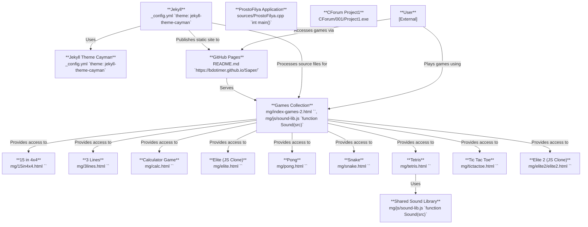

# Unnamed CodeViz Diagram

```mermaid
graph TD

    base.cv::user["**User**<br>[External]"]
    base.cv::games_collection["**Games Collection**<br>mg/index-games-2.html `<!DOCTYPE html>`, mg/js/sound-lib.js `function Sound(src)`"]
    base.cv::game_15in4x4["**15 in 4x4**<br>mg/15in4x4.html `<!DOCTYPE html>`"]
    base.cv::game_3lines["**3 Lines**<br>mg/3lines.html `<!DOCTYPE html>`"]
    base.cv::game_calc["**Calculator Game**<br>mg/calc.html `<!DOCTYPE html>`"]
    base.cv::game_elite["**Elite (JS Clone)**<br>mg/elite.html `<!DOCTYPE html>`"]
    base.cv::game_pong["**Pong**<br>mg/pong.html `<!DOCTYPE html>`"]
    base.cv::game_snake["**Snake**<br>mg/snake.html `<!DOCTYPE html>`"]
    base.cv::game_tetris["**Tetris**<br>mg/tetris.html `<!DOCTYPE html>`"]
    base.cv::game_tictactoe["**Tic Tac Toe**<br>mg/tictactoe.html `<!DOCTYPE document html>`"]
    base.cv::game_elite2["**Elite 2 (JS Clone)**<br>mg/elite2/elite2.html `<!DOCTYPE html>`"]
    base.cv::shared_sound_lib["**Shared Sound Library**<br>mg/js/sound-lib.js `function Sound(src)`"]
    base.cv::prosto_filya["**ProstoFilya Application**<br>sources/ProstoFilya.cpp `int main()`"]
    base.cv::cforum_project1["**CForum Project1**<br>CForum/001/Project1.exe"]
    base.cv::jekyll["**Jekyll**<br>_config.yml `theme: jekyll-theme-cayman`"]
    base.cv::jekyll_theme_cayman["**Jekyll Theme Cayman**<br>_config.yml `theme: jekyll-theme-cayman`"]
    base.cv::github_pages["**GitHub Pages**<br>README.md `https://bdotimer.github.io/Saper/`"]
    %% Edges at this level (grouped by source)
    base.cv::user["**User**<br>[External]"] -->|"Plays games using"| base.cv::games_collection["**Games Collection**<br>mg/index-games-2.html `<!DOCTYPE html>`, mg/js/sound-lib.js `function Sound(src)`"]
    base.cv::user["**User**<br>[External]"] -->|"Accesses games via"| base.cv::github_pages["**GitHub Pages**<br>README.md `https://bdotimer.github.io/Saper/`"]
    base.cv::games_collection["**Games Collection**<br>mg/index-games-2.html `<!DOCTYPE html>`, mg/js/sound-lib.js `function Sound(src)`"] -->|"Provides access to"| base.cv::game_15in4x4["**15 in 4x4**<br>mg/15in4x4.html `<!DOCTYPE html>`"]
    base.cv::games_collection["**Games Collection**<br>mg/index-games-2.html `<!DOCTYPE html>`, mg/js/sound-lib.js `function Sound(src)`"] -->|"Provides access to"| base.cv::game_3lines["**3 Lines**<br>mg/3lines.html `<!DOCTYPE html>`"]
    base.cv::games_collection["**Games Collection**<br>mg/index-games-2.html `<!DOCTYPE html>`, mg/js/sound-lib.js `function Sound(src)`"] -->|"Provides access to"| base.cv::game_calc["**Calculator Game**<br>mg/calc.html `<!DOCTYPE html>`"]
    base.cv::games_collection["**Games Collection**<br>mg/index-games-2.html `<!DOCTYPE html>`, mg/js/sound-lib.js `function Sound(src)`"] -->|"Provides access to"| base.cv::game_elite["**Elite (JS Clone)**<br>mg/elite.html `<!DOCTYPE html>`"]
    base.cv::games_collection["**Games Collection**<br>mg/index-games-2.html `<!DOCTYPE html>`, mg/js/sound-lib.js `function Sound(src)`"] -->|"Provides access to"| base.cv::game_pong["**Pong**<br>mg/pong.html `<!DOCTYPE html>`"]
    base.cv::games_collection["**Games Collection**<br>mg/index-games-2.html `<!DOCTYPE html>`, mg/js/sound-lib.js `function Sound(src)`"] -->|"Provides access to"| base.cv::game_snake["**Snake**<br>mg/snake.html `<!DOCTYPE html>`"]
    base.cv::games_collection["**Games Collection**<br>mg/index-games-2.html `<!DOCTYPE html>`, mg/js/sound-lib.js `function Sound(src)`"] -->|"Provides access to"| base.cv::game_tetris["**Tetris**<br>mg/tetris.html `<!DOCTYPE html>`"]
    base.cv::games_collection["**Games Collection**<br>mg/index-games-2.html `<!DOCTYPE html>`, mg/js/sound-lib.js `function Sound(src)`"] -->|"Provides access to"| base.cv::game_tictactoe["**Tic Tac Toe**<br>mg/tictactoe.html `<!DOCTYPE document html>`"]
    base.cv::games_collection["**Games Collection**<br>mg/index-games-2.html `<!DOCTYPE html>`, mg/js/sound-lib.js `function Sound(src)`"] -->|"Provides access to"| base.cv::game_elite2["**Elite 2 (JS Clone)**<br>mg/elite2/elite2.html `<!DOCTYPE html>`"]
    base.cv::game_tetris["**Tetris**<br>mg/tetris.html `<!DOCTYPE html>`"] -->|"Uses"| base.cv::shared_sound_lib["**Shared Sound Library**<br>mg/js/sound-lib.js `function Sound(src)`"]
    base.cv::jekyll["**Jekyll**<br>_config.yml `theme: jekyll-theme-cayman`"] -->|"Uses"| base.cv::jekyll_theme_cayman["**Jekyll Theme Cayman**<br>_config.yml `theme: jekyll-theme-cayman`"]
    base.cv::jekyll["**Jekyll**<br>_config.yml `theme: jekyll-theme-cayman`"] -->|"Processes source files for"| base.cv::games_collection["**Games Collection**<br>mg/index-games-2.html `<!DOCTYPE html>`, mg/js/sound-lib.js `function Sound(src)`"]
    base.cv::jekyll["**Jekyll**<br>_config.yml `theme: jekyll-theme-cayman`"] -->|"Publishes static site to"| base.cv::github_pages["**GitHub Pages**<br>README.md `https://bdotimer.github.io/Saper/`"]
    base.cv::github_pages["**GitHub Pages**<br>README.md `https://bdotimer.github.io/Saper/`"] -->|"Serves"| base.cv::games_collection["**Games Collection**<br>mg/index-games-2.html `<!DOCTYPE html>`, mg/js/sound-lib.js `function Sound(src)`"]

```

---

_Generated by [CodeViz.ai](https://codeviz.ai) on 9/27/2026, 3:36:38 PM_
